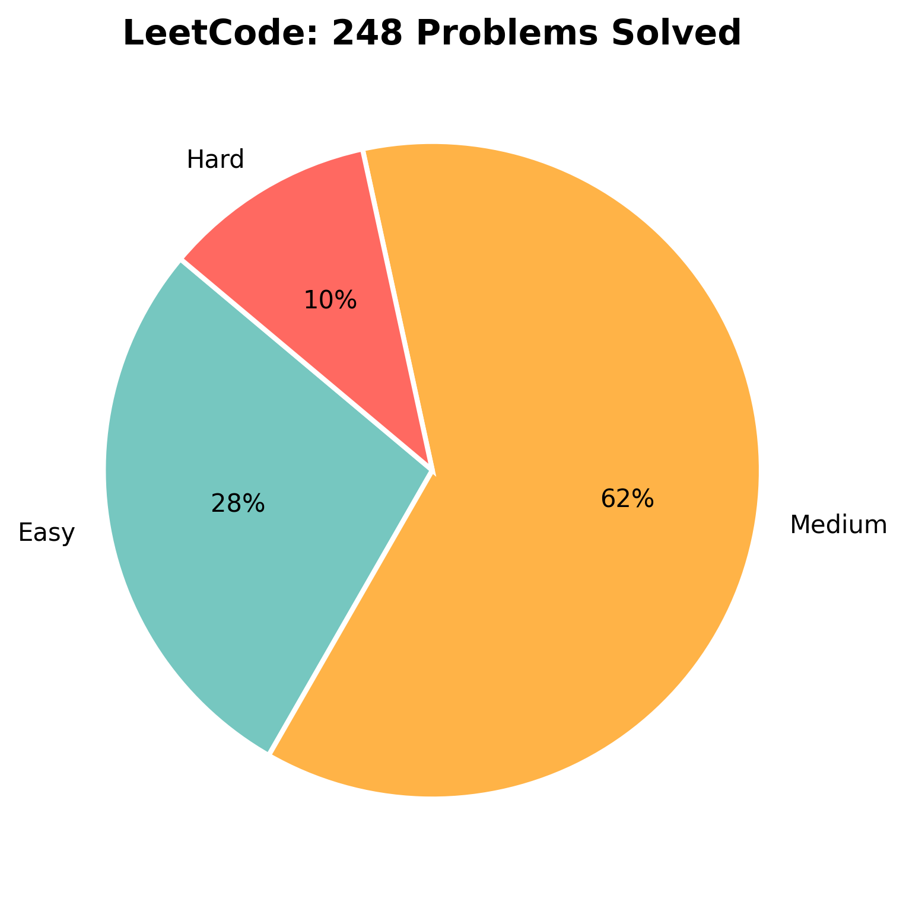

# LeetCode-Multiverse
Collection of LeetCode questions & solutions.

<!---LeetCode Topics Start-->
# LeetCode Topics
## Array
|  |
| ------- |
| [0001-two-sum](https://github.com/RashadTanjim/LeetCode-Multiverse/tree/master/0001-two-sum) |
| [0004-median-of-two-sorted-arrays](https://github.com/RashadTanjim/LeetCode-Multiverse/tree/master/0004-median-of-two-sorted-arrays) |
| [0011-container-with-most-water](https://github.com/RashadTanjim/LeetCode-Multiverse/tree/master/0011-container-with-most-water) |
| [0015-3sum](https://github.com/RashadTanjim/LeetCode-Multiverse/tree/master/0015-3sum) |
| [0026-remove-duplicates-from-sorted-array](https://github.com/RashadTanjim/LeetCode-Multiverse/tree/master/0026-remove-duplicates-from-sorted-array) |
| [0027-remove-element](https://github.com/RashadTanjim/LeetCode-Multiverse/tree/master/0027-remove-element) |
| [0031-next-permutation](https://github.com/RashadTanjim/LeetCode-Multiverse/tree/master/0031-next-permutation) |
| [0033-search-in-rotated-sorted-array](https://github.com/RashadTanjim/LeetCode-Multiverse/tree/master/0033-search-in-rotated-sorted-array) |
| [0034-find-first-and-last-position-of-element-in-sorted-array](https://github.com/RashadTanjim/LeetCode-Multiverse/tree/master/0034-find-first-and-last-position-of-element-in-sorted-array) |
| [0035-search-insert-position](https://github.com/RashadTanjim/LeetCode-Multiverse/tree/master/0035-search-insert-position) |
| [0036-valid-sudoku](https://github.com/RashadTanjim/LeetCode-Multiverse/tree/master/0036-valid-sudoku) |
| [0039-combination-sum](https://github.com/RashadTanjim/LeetCode-Multiverse/tree/master/0039-combination-sum) |
| [0041-first-missing-positive](https://github.com/RashadTanjim/LeetCode-Multiverse/tree/master/0041-first-missing-positive) |
| [0042-trapping-rain-water](https://github.com/RashadTanjim/LeetCode-Multiverse/tree/master/0042-trapping-rain-water) |
| [0045-jump-game-ii](https://github.com/RashadTanjim/LeetCode-Multiverse/tree/master/0045-jump-game-ii) |
| [0046-permutations](https://github.com/RashadTanjim/LeetCode-Multiverse/tree/master/0046-permutations) |
| [0048-rotate-image](https://github.com/RashadTanjim/LeetCode-Multiverse/tree/master/0048-rotate-image) |
| [0049-group-anagrams](https://github.com/RashadTanjim/LeetCode-Multiverse/tree/master/0049-group-anagrams) |
| [0051-n-queens](https://github.com/RashadTanjim/LeetCode-Multiverse/tree/master/0051-n-queens) |
| [0053-maximum-subarray](https://github.com/RashadTanjim/LeetCode-Multiverse/tree/master/0053-maximum-subarray) |
| [0054-spiral-matrix](https://github.com/RashadTanjim/LeetCode-Multiverse/tree/master/0054-spiral-matrix) |
| [0055-jump-game](https://github.com/RashadTanjim/LeetCode-Multiverse/tree/master/0055-jump-game) |
| [0056-merge-intervals](https://github.com/RashadTanjim/LeetCode-Multiverse/tree/master/0056-merge-intervals) |
| [0057-insert-interval](https://github.com/RashadTanjim/LeetCode-Multiverse/tree/master/0057-insert-interval) |
| [0063-unique-paths-ii](https://github.com/RashadTanjim/LeetCode-Multiverse/tree/master/0063-unique-paths-ii) |
| [0064-minimum-path-sum](https://github.com/RashadTanjim/LeetCode-Multiverse/tree/master/0064-minimum-path-sum) |
| [0066-plus-one](https://github.com/RashadTanjim/LeetCode-Multiverse/tree/master/0066-plus-one) |
| [0068-text-justification](https://github.com/RashadTanjim/LeetCode-Multiverse/tree/master/0068-text-justification) |
| [0073-set-matrix-zeroes](https://github.com/RashadTanjim/LeetCode-Multiverse/tree/master/0073-set-matrix-zeroes) |
| [0074-search-a-2d-matrix](https://github.com/RashadTanjim/LeetCode-Multiverse/tree/master/0074-search-a-2d-matrix) |
| [0075-sort-colors](https://github.com/RashadTanjim/LeetCode-Multiverse/tree/master/0075-sort-colors) |
| [0078-subsets](https://github.com/RashadTanjim/LeetCode-Multiverse/tree/master/0078-subsets) |
| [0079-word-search](https://github.com/RashadTanjim/LeetCode-Multiverse/tree/master/0079-word-search) |
| [0080-remove-duplicates-from-sorted-array-ii](https://github.com/RashadTanjim/LeetCode-Multiverse/tree/master/0080-remove-duplicates-from-sorted-array-ii) |
| [0084-largest-rectangle-in-histogram](https://github.com/RashadTanjim/LeetCode-Multiverse/tree/master/0084-largest-rectangle-in-histogram) |
| [0088-merge-sorted-array](https://github.com/RashadTanjim/LeetCode-Multiverse/tree/master/0088-merge-sorted-array) |
| [0105-construct-binary-tree-from-preorder-and-inorder-traversal](https://github.com/RashadTanjim/LeetCode-Multiverse/tree/master/0105-construct-binary-tree-from-preorder-and-inorder-traversal) |
| [0106-construct-binary-tree-from-inorder-and-postorder-traversal](https://github.com/RashadTanjim/LeetCode-Multiverse/tree/master/0106-construct-binary-tree-from-inorder-and-postorder-traversal) |
| [0108-convert-sorted-array-to-binary-search-tree](https://github.com/RashadTanjim/LeetCode-Multiverse/tree/master/0108-convert-sorted-array-to-binary-search-tree) |
| [0118-pascals-triangle](https://github.com/RashadTanjim/LeetCode-Multiverse/tree/master/0118-pascals-triangle) |
| [0120-triangle](https://github.com/RashadTanjim/LeetCode-Multiverse/tree/master/0120-triangle) |
| [0121-best-time-to-buy-and-sell-stock](https://github.com/RashadTanjim/LeetCode-Multiverse/tree/master/0121-best-time-to-buy-and-sell-stock) |
| [0122-best-time-to-buy-and-sell-stock-ii](https://github.com/RashadTanjim/LeetCode-Multiverse/tree/master/0122-best-time-to-buy-and-sell-stock-ii) |
| [0123-best-time-to-buy-and-sell-stock-iii](https://github.com/RashadTanjim/LeetCode-Multiverse/tree/master/0123-best-time-to-buy-and-sell-stock-iii) |
| [0128-longest-consecutive-sequence](https://github.com/RashadTanjim/LeetCode-Multiverse/tree/master/0128-longest-consecutive-sequence) |
| [0130-surrounded-regions](https://github.com/RashadTanjim/LeetCode-Multiverse/tree/master/0130-surrounded-regions) |
| [0134-gas-station](https://github.com/RashadTanjim/LeetCode-Multiverse/tree/master/0134-gas-station) |
| [0135-candy](https://github.com/RashadTanjim/LeetCode-Multiverse/tree/master/0135-candy) |
| [0136-single-number](https://github.com/RashadTanjim/LeetCode-Multiverse/tree/master/0136-single-number) |
| [0137-single-number-ii](https://github.com/RashadTanjim/LeetCode-Multiverse/tree/master/0137-single-number-ii) |
| [0139-word-break](https://github.com/RashadTanjim/LeetCode-Multiverse/tree/master/0139-word-break) |
| [0149-max-points-on-a-line](https://github.com/RashadTanjim/LeetCode-Multiverse/tree/master/0149-max-points-on-a-line) |
| [0150-evaluate-reverse-polish-notation](https://github.com/RashadTanjim/LeetCode-Multiverse/tree/master/0150-evaluate-reverse-polish-notation) |
| [0152-maximum-product-subarray](https://github.com/RashadTanjim/LeetCode-Multiverse/tree/master/0152-maximum-product-subarray) |
| [0153-find-minimum-in-rotated-sorted-array](https://github.com/RashadTanjim/LeetCode-Multiverse/tree/master/0153-find-minimum-in-rotated-sorted-array) |
| [0162-find-peak-element](https://github.com/RashadTanjim/LeetCode-Multiverse/tree/master/0162-find-peak-element) |
| [0167-two-sum-ii-input-array-is-sorted](https://github.com/RashadTanjim/LeetCode-Multiverse/tree/master/0167-two-sum-ii-input-array-is-sorted) |
| [0169-majority-element](https://github.com/RashadTanjim/LeetCode-Multiverse/tree/master/0169-majority-element) |
| [0188-best-time-to-buy-and-sell-stock-iv](https://github.com/RashadTanjim/LeetCode-Multiverse/tree/master/0188-best-time-to-buy-and-sell-stock-iv) |
| [0189-rotate-array](https://github.com/RashadTanjim/LeetCode-Multiverse/tree/master/0189-rotate-array) |
| [0198-house-robber](https://github.com/RashadTanjim/LeetCode-Multiverse/tree/master/0198-house-robber) |
| [0200-number-of-islands](https://github.com/RashadTanjim/LeetCode-Multiverse/tree/master/0200-number-of-islands) |
| [0209-minimum-size-subarray-sum](https://github.com/RashadTanjim/LeetCode-Multiverse/tree/master/0209-minimum-size-subarray-sum) |
| [0212-word-search-ii](https://github.com/RashadTanjim/LeetCode-Multiverse/tree/master/0212-word-search-ii) |
| [0215-kth-largest-element-in-an-array](https://github.com/RashadTanjim/LeetCode-Multiverse/tree/master/0215-kth-largest-element-in-an-array) |
| [0219-contains-duplicate-ii](https://github.com/RashadTanjim/LeetCode-Multiverse/tree/master/0219-contains-duplicate-ii) |
| [0221-maximal-square](https://github.com/RashadTanjim/LeetCode-Multiverse/tree/master/0221-maximal-square) |
| [0228-summary-ranges](https://github.com/RashadTanjim/LeetCode-Multiverse/tree/master/0228-summary-ranges) |
| [0238-product-of-array-except-self](https://github.com/RashadTanjim/LeetCode-Multiverse/tree/master/0238-product-of-array-except-self) |
| [0239-sliding-window-maximum](https://github.com/RashadTanjim/LeetCode-Multiverse/tree/master/0239-sliding-window-maximum) |
| [0240-search-a-2d-matrix-ii](https://github.com/RashadTanjim/LeetCode-Multiverse/tree/master/0240-search-a-2d-matrix-ii) |
| [0274-h-index](https://github.com/RashadTanjim/LeetCode-Multiverse/tree/master/0274-h-index) |
| [0283-move-zeroes](https://github.com/RashadTanjim/LeetCode-Multiverse/tree/master/0283-move-zeroes) |
| [0287-find-the-duplicate-number](https://github.com/RashadTanjim/LeetCode-Multiverse/tree/master/0287-find-the-duplicate-number) |
| [0289-game-of-life](https://github.com/RashadTanjim/LeetCode-Multiverse/tree/master/0289-game-of-life) |
| [0300-longest-increasing-subsequence](https://github.com/RashadTanjim/LeetCode-Multiverse/tree/master/0300-longest-increasing-subsequence) |
| [0303-range-sum-query-immutable](https://github.com/RashadTanjim/LeetCode-Multiverse/tree/master/0303-range-sum-query-immutable) |
| [0307-range-sum-query-mutable](https://github.com/RashadTanjim/LeetCode-Multiverse/tree/master/0307-range-sum-query-mutable) |
| [0322-coin-change](https://github.com/RashadTanjim/LeetCode-Multiverse/tree/master/0322-coin-change) |
| [0334-increasing-triplet-subsequence](https://github.com/RashadTanjim/LeetCode-Multiverse/tree/master/0334-increasing-triplet-subsequence) |
| [0347-top-k-frequent-elements](https://github.com/RashadTanjim/LeetCode-Multiverse/tree/master/0347-top-k-frequent-elements) |
| [0373-find-k-pairs-with-smallest-sums](https://github.com/RashadTanjim/LeetCode-Multiverse/tree/master/0373-find-k-pairs-with-smallest-sums) |
| [0380-insert-delete-getrandom-o1](https://github.com/RashadTanjim/LeetCode-Multiverse/tree/master/0380-insert-delete-getrandom-o1) |
| [0399-evaluate-division](https://github.com/RashadTanjim/LeetCode-Multiverse/tree/master/0399-evaluate-division) |
| [0416-partition-equal-subset-sum](https://github.com/RashadTanjim/LeetCode-Multiverse/tree/master/0416-partition-equal-subset-sum) |
| [0452-minimum-number-of-arrows-to-burst-balloons](https://github.com/RashadTanjim/LeetCode-Multiverse/tree/master/0452-minimum-number-of-arrows-to-burst-balloons) |
| [0502-ipo](https://github.com/RashadTanjim/LeetCode-Multiverse/tree/master/0502-ipo) |
| [0560-subarray-sum-equals-k](https://github.com/RashadTanjim/LeetCode-Multiverse/tree/master/0560-subarray-sum-equals-k) |
| [0605-can-place-flowers](https://github.com/RashadTanjim/LeetCode-Multiverse/tree/master/0605-can-place-flowers) |
| [0643-maximum-average-subarray-i](https://github.com/RashadTanjim/LeetCode-Multiverse/tree/master/0643-maximum-average-subarray-i) |
| [0724-find-pivot-index](https://github.com/RashadTanjim/LeetCode-Multiverse/tree/master/0724-find-pivot-index) |
| [0739-daily-temperatures](https://github.com/RashadTanjim/LeetCode-Multiverse/tree/master/0739-daily-temperatures) |
| [0772-construct-quad-tree](https://github.com/RashadTanjim/LeetCode-Multiverse/tree/master/0772-construct-quad-tree) |
| [0945-snakes-and-ladders](https://github.com/RashadTanjim/LeetCode-Multiverse/tree/master/0945-snakes-and-ladders) |
| [0954-maximum-sum-circular-subarray](https://github.com/RashadTanjim/LeetCode-Multiverse/tree/master/0954-maximum-sum-circular-subarray) |
| [1036-rotting-oranges](https://github.com/RashadTanjim/LeetCode-Multiverse/tree/master/1036-rotting-oranges) |
| [1046-max-consecutive-ones-iii](https://github.com/RashadTanjim/LeetCode-Multiverse/tree/master/1046-max-consecutive-ones-iii) |
| [1319-unique-number-of-occurrences](https://github.com/RashadTanjim/LeetCode-Multiverse/tree/master/1319-unique-number-of-occurrences) |
| [1392-find-the-difference-of-two-arrays](https://github.com/RashadTanjim/LeetCode-Multiverse/tree/master/1392-find-the-difference-of-two-arrays) |
| [1438-longest-continuous-subarray-with-absolute-diff-less-than-or-equal-to-limit](https://github.com/RashadTanjim/LeetCode-Multiverse/tree/master/1438-longest-continuous-subarray-with-absolute-diff-less-than-or-equal-to-limit) |
| [1483-rank-teams-by-votes](https://github.com/RashadTanjim/LeetCode-Multiverse/tree/master/1483-rank-teams-by-votes) |
| [1528-kids-with-the-greatest-number-of-candies](https://github.com/RashadTanjim/LeetCode-Multiverse/tree/master/1528-kids-with-the-greatest-number-of-candies) |
| [1586-longest-subarray-of-1s-after-deleting-one-element](https://github.com/RashadTanjim/LeetCode-Multiverse/tree/master/1586-longest-subarray-of-1s-after-deleting-one-element) |
| [1798-max-number-of-k-sum-pairs](https://github.com/RashadTanjim/LeetCode-Multiverse/tree/master/1798-max-number-of-k-sum-pairs) |
| [1833-find-the-highest-altitude](https://github.com/RashadTanjim/LeetCode-Multiverse/tree/master/1833-find-the-highest-altitude) |
| [1878-check-if-array-is-sorted-and-rotated](https://github.com/RashadTanjim/LeetCode-Multiverse/tree/master/1878-check-if-array-is-sorted-and-rotated) |
| [2102-find-the-middle-index-in-array](https://github.com/RashadTanjim/LeetCode-Multiverse/tree/master/2102-find-the-middle-index-in-array) |
| [3820-number-of-unique-xor-triplets-ii](https://github.com/RashadTanjim/LeetCode-Multiverse/tree/master/3820-number-of-unique-xor-triplets-ii) |
| [3824-number-of-unique-xor-triplets-i](https://github.com/RashadTanjim/LeetCode-Multiverse/tree/master/3824-number-of-unique-xor-triplets-i) |
| [3846-minimum-operations-to-make-array-sum-divisible-by-k](https://github.com/RashadTanjim/LeetCode-Multiverse/tree/master/3846-minimum-operations-to-make-array-sum-divisible-by-k) |
## Dynamic Programming
|  |
| ------- |
| [0005-longest-palindromic-substring](https://github.com/RashadTanjim/LeetCode-Multiverse/tree/master/0005-longest-palindromic-substring) |
| [0022-generate-parentheses](https://github.com/RashadTanjim/LeetCode-Multiverse/tree/master/0022-generate-parentheses) |
| [0032-longest-valid-parentheses](https://github.com/RashadTanjim/LeetCode-Multiverse/tree/master/0032-longest-valid-parentheses) |
| [0042-trapping-rain-water](https://github.com/RashadTanjim/LeetCode-Multiverse/tree/master/0042-trapping-rain-water) |
| [0045-jump-game-ii](https://github.com/RashadTanjim/LeetCode-Multiverse/tree/master/0045-jump-game-ii) |
| [0053-maximum-subarray](https://github.com/RashadTanjim/LeetCode-Multiverse/tree/master/0053-maximum-subarray) |
| [0055-jump-game](https://github.com/RashadTanjim/LeetCode-Multiverse/tree/master/0055-jump-game) |
| [0062-unique-paths](https://github.com/RashadTanjim/LeetCode-Multiverse/tree/master/0062-unique-paths) |
| [0063-unique-paths-ii](https://github.com/RashadTanjim/LeetCode-Multiverse/tree/master/0063-unique-paths-ii) |
| [0064-minimum-path-sum](https://github.com/RashadTanjim/LeetCode-Multiverse/tree/master/0064-minimum-path-sum) |
| [0070-climbing-stairs](https://github.com/RashadTanjim/LeetCode-Multiverse/tree/master/0070-climbing-stairs) |
| [0072-edit-distance](https://github.com/RashadTanjim/LeetCode-Multiverse/tree/master/0072-edit-distance) |
| [0097-interleaving-string](https://github.com/RashadTanjim/LeetCode-Multiverse/tree/master/0097-interleaving-string) |
| [0118-pascals-triangle](https://github.com/RashadTanjim/LeetCode-Multiverse/tree/master/0118-pascals-triangle) |
| [0120-triangle](https://github.com/RashadTanjim/LeetCode-Multiverse/tree/master/0120-triangle) |
| [0121-best-time-to-buy-and-sell-stock](https://github.com/RashadTanjim/LeetCode-Multiverse/tree/master/0121-best-time-to-buy-and-sell-stock) |
| [0122-best-time-to-buy-and-sell-stock-ii](https://github.com/RashadTanjim/LeetCode-Multiverse/tree/master/0122-best-time-to-buy-and-sell-stock-ii) |
| [0123-best-time-to-buy-and-sell-stock-iii](https://github.com/RashadTanjim/LeetCode-Multiverse/tree/master/0123-best-time-to-buy-and-sell-stock-iii) |
| [0124-binary-tree-maximum-path-sum](https://github.com/RashadTanjim/LeetCode-Multiverse/tree/master/0124-binary-tree-maximum-path-sum) |
| [0131-palindrome-partitioning](https://github.com/RashadTanjim/LeetCode-Multiverse/tree/master/0131-palindrome-partitioning) |
| [0139-word-break](https://github.com/RashadTanjim/LeetCode-Multiverse/tree/master/0139-word-break) |
| [0152-maximum-product-subarray](https://github.com/RashadTanjim/LeetCode-Multiverse/tree/master/0152-maximum-product-subarray) |
| [0188-best-time-to-buy-and-sell-stock-iv](https://github.com/RashadTanjim/LeetCode-Multiverse/tree/master/0188-best-time-to-buy-and-sell-stock-iv) |
| [0198-house-robber](https://github.com/RashadTanjim/LeetCode-Multiverse/tree/master/0198-house-robber) |
| [0221-maximal-square](https://github.com/RashadTanjim/LeetCode-Multiverse/tree/master/0221-maximal-square) |
| [0279-perfect-squares](https://github.com/RashadTanjim/LeetCode-Multiverse/tree/master/0279-perfect-squares) |
| [0300-longest-increasing-subsequence](https://github.com/RashadTanjim/LeetCode-Multiverse/tree/master/0300-longest-increasing-subsequence) |
| [0322-coin-change](https://github.com/RashadTanjim/LeetCode-Multiverse/tree/master/0322-coin-change) |
| [0392-is-subsequence](https://github.com/RashadTanjim/LeetCode-Multiverse/tree/master/0392-is-subsequence) |
| [0416-partition-equal-subset-sum](https://github.com/RashadTanjim/LeetCode-Multiverse/tree/master/0416-partition-equal-subset-sum) |
| [0954-maximum-sum-circular-subarray](https://github.com/RashadTanjim/LeetCode-Multiverse/tree/master/0954-maximum-sum-circular-subarray) |
| [1236-n-th-tribonacci-number](https://github.com/RashadTanjim/LeetCode-Multiverse/tree/master/1236-n-th-tribonacci-number) |
| [1250-longest-common-subsequence](https://github.com/RashadTanjim/LeetCode-Multiverse/tree/master/1250-longest-common-subsequence) |
| [1586-longest-subarray-of-1s-after-deleting-one-element](https://github.com/RashadTanjim/LeetCode-Multiverse/tree/master/1586-longest-subarray-of-1s-after-deleting-one-element) |
## Greedy
|  |
| ------- |
| [0011-container-with-most-water](https://github.com/RashadTanjim/LeetCode-Multiverse/tree/master/0011-container-with-most-water) |
| [0045-jump-game-ii](https://github.com/RashadTanjim/LeetCode-Multiverse/tree/master/0045-jump-game-ii) |
| [0055-jump-game](https://github.com/RashadTanjim/LeetCode-Multiverse/tree/master/0055-jump-game) |
| [0122-best-time-to-buy-and-sell-stock-ii](https://github.com/RashadTanjim/LeetCode-Multiverse/tree/master/0122-best-time-to-buy-and-sell-stock-ii) |
| [0134-gas-station](https://github.com/RashadTanjim/LeetCode-Multiverse/tree/master/0134-gas-station) |
| [0135-candy](https://github.com/RashadTanjim/LeetCode-Multiverse/tree/master/0135-candy) |
| [0334-increasing-triplet-subsequence](https://github.com/RashadTanjim/LeetCode-Multiverse/tree/master/0334-increasing-triplet-subsequence) |
| [0452-minimum-number-of-arrows-to-burst-balloons](https://github.com/RashadTanjim/LeetCode-Multiverse/tree/master/0452-minimum-number-of-arrows-to-burst-balloons) |
| [0502-ipo](https://github.com/RashadTanjim/LeetCode-Multiverse/tree/master/0502-ipo) |
| [0605-can-place-flowers](https://github.com/RashadTanjim/LeetCode-Multiverse/tree/master/0605-can-place-flowers) |
| [0768-partition-labels](https://github.com/RashadTanjim/LeetCode-Multiverse/tree/master/0768-partition-labels) |
## Hash Table
|  |
| ------- |
| [0001-two-sum](https://github.com/RashadTanjim/LeetCode-Multiverse/tree/master/0001-two-sum) |
| [0003-longest-substring-without-repeating-characters](https://github.com/RashadTanjim/LeetCode-Multiverse/tree/master/0003-longest-substring-without-repeating-characters) |
| [0012-integer-to-roman](https://github.com/RashadTanjim/LeetCode-Multiverse/tree/master/0012-integer-to-roman) |
| [0013-roman-to-integer](https://github.com/RashadTanjim/LeetCode-Multiverse/tree/master/0013-roman-to-integer) |
| [0017-letter-combinations-of-a-phone-number](https://github.com/RashadTanjim/LeetCode-Multiverse/tree/master/0017-letter-combinations-of-a-phone-number) |
| [0030-substring-with-concatenation-of-all-words](https://github.com/RashadTanjim/LeetCode-Multiverse/tree/master/0030-substring-with-concatenation-of-all-words) |
| [0036-valid-sudoku](https://github.com/RashadTanjim/LeetCode-Multiverse/tree/master/0036-valid-sudoku) |
| [0041-first-missing-positive](https://github.com/RashadTanjim/LeetCode-Multiverse/tree/master/0041-first-missing-positive) |
| [0049-group-anagrams](https://github.com/RashadTanjim/LeetCode-Multiverse/tree/master/0049-group-anagrams) |
| [0073-set-matrix-zeroes](https://github.com/RashadTanjim/LeetCode-Multiverse/tree/master/0073-set-matrix-zeroes) |
| [0076-minimum-window-substring](https://github.com/RashadTanjim/LeetCode-Multiverse/tree/master/0076-minimum-window-substring) |
| [0105-construct-binary-tree-from-preorder-and-inorder-traversal](https://github.com/RashadTanjim/LeetCode-Multiverse/tree/master/0105-construct-binary-tree-from-preorder-and-inorder-traversal) |
| [0106-construct-binary-tree-from-inorder-and-postorder-traversal](https://github.com/RashadTanjim/LeetCode-Multiverse/tree/master/0106-construct-binary-tree-from-inorder-and-postorder-traversal) |
| [0127-word-ladder](https://github.com/RashadTanjim/LeetCode-Multiverse/tree/master/0127-word-ladder) |
| [0128-longest-consecutive-sequence](https://github.com/RashadTanjim/LeetCode-Multiverse/tree/master/0128-longest-consecutive-sequence) |
| [0133-clone-graph](https://github.com/RashadTanjim/LeetCode-Multiverse/tree/master/0133-clone-graph) |
| [0138-copy-list-with-random-pointer](https://github.com/RashadTanjim/LeetCode-Multiverse/tree/master/0138-copy-list-with-random-pointer) |
| [0139-word-break](https://github.com/RashadTanjim/LeetCode-Multiverse/tree/master/0139-word-break) |
| [0141-linked-list-cycle](https://github.com/RashadTanjim/LeetCode-Multiverse/tree/master/0141-linked-list-cycle) |
| [0142-linked-list-cycle-ii](https://github.com/RashadTanjim/LeetCode-Multiverse/tree/master/0142-linked-list-cycle-ii) |
| [0146-lru-cache](https://github.com/RashadTanjim/LeetCode-Multiverse/tree/master/0146-lru-cache) |
| [0149-max-points-on-a-line](https://github.com/RashadTanjim/LeetCode-Multiverse/tree/master/0149-max-points-on-a-line) |
| [0160-intersection-of-two-linked-lists](https://github.com/RashadTanjim/LeetCode-Multiverse/tree/master/0160-intersection-of-two-linked-lists) |
| [0169-majority-element](https://github.com/RashadTanjim/LeetCode-Multiverse/tree/master/0169-majority-element) |
| [0202-happy-number](https://github.com/RashadTanjim/LeetCode-Multiverse/tree/master/0202-happy-number) |
| [0205-isomorphic-strings](https://github.com/RashadTanjim/LeetCode-Multiverse/tree/master/0205-isomorphic-strings) |
| [0208-implement-trie-prefix-tree](https://github.com/RashadTanjim/LeetCode-Multiverse/tree/master/0208-implement-trie-prefix-tree) |
| [0219-contains-duplicate-ii](https://github.com/RashadTanjim/LeetCode-Multiverse/tree/master/0219-contains-duplicate-ii) |
| [0242-valid-anagram](https://github.com/RashadTanjim/LeetCode-Multiverse/tree/master/0242-valid-anagram) |
| [0290-word-pattern](https://github.com/RashadTanjim/LeetCode-Multiverse/tree/master/0290-word-pattern) |
| [0347-top-k-frequent-elements](https://github.com/RashadTanjim/LeetCode-Multiverse/tree/master/0347-top-k-frequent-elements) |
| [0380-insert-delete-getrandom-o1](https://github.com/RashadTanjim/LeetCode-Multiverse/tree/master/0380-insert-delete-getrandom-o1) |
| [0383-ransom-note](https://github.com/RashadTanjim/LeetCode-Multiverse/tree/master/0383-ransom-note) |
| [0432-all-oone-data-structure](https://github.com/RashadTanjim/LeetCode-Multiverse/tree/master/0432-all-oone-data-structure) |
| [0433-minimum-genetic-mutation](https://github.com/RashadTanjim/LeetCode-Multiverse/tree/master/0433-minimum-genetic-mutation) |
| [0438-find-all-anagrams-in-a-string](https://github.com/RashadTanjim/LeetCode-Multiverse/tree/master/0438-find-all-anagrams-in-a-string) |
| [0560-subarray-sum-equals-k](https://github.com/RashadTanjim/LeetCode-Multiverse/tree/master/0560-subarray-sum-equals-k) |
| [0768-partition-labels](https://github.com/RashadTanjim/LeetCode-Multiverse/tree/master/0768-partition-labels) |
| [1319-unique-number-of-occurrences](https://github.com/RashadTanjim/LeetCode-Multiverse/tree/master/1319-unique-number-of-occurrences) |
| [1392-find-the-difference-of-two-arrays](https://github.com/RashadTanjim/LeetCode-Multiverse/tree/master/1392-find-the-difference-of-two-arrays) |
| [1483-rank-teams-by-votes](https://github.com/RashadTanjim/LeetCode-Multiverse/tree/master/1483-rank-teams-by-votes) |
| [1798-max-number-of-k-sum-pairs](https://github.com/RashadTanjim/LeetCode-Multiverse/tree/master/1798-max-number-of-k-sum-pairs) |
## Divide and Conquer
|  |
| ------- |
| [0004-median-of-two-sorted-arrays](https://github.com/RashadTanjim/LeetCode-Multiverse/tree/master/0004-median-of-two-sorted-arrays) |
| [0023-merge-k-sorted-lists](https://github.com/RashadTanjim/LeetCode-Multiverse/tree/master/0023-merge-k-sorted-lists) |
| [0053-maximum-subarray](https://github.com/RashadTanjim/LeetCode-Multiverse/tree/master/0053-maximum-subarray) |
| [0105-construct-binary-tree-from-preorder-and-inorder-traversal](https://github.com/RashadTanjim/LeetCode-Multiverse/tree/master/0105-construct-binary-tree-from-preorder-and-inorder-traversal) |
| [0106-construct-binary-tree-from-inorder-and-postorder-traversal](https://github.com/RashadTanjim/LeetCode-Multiverse/tree/master/0106-construct-binary-tree-from-inorder-and-postorder-traversal) |
| [0108-convert-sorted-array-to-binary-search-tree](https://github.com/RashadTanjim/LeetCode-Multiverse/tree/master/0108-convert-sorted-array-to-binary-search-tree) |
| [0148-sort-list](https://github.com/RashadTanjim/LeetCode-Multiverse/tree/master/0148-sort-list) |
| [0169-majority-element](https://github.com/RashadTanjim/LeetCode-Multiverse/tree/master/0169-majority-element) |
| [0190-reverse-bits](https://github.com/RashadTanjim/LeetCode-Multiverse/tree/master/0190-reverse-bits) |
| [0191-number-of-1-bits](https://github.com/RashadTanjim/LeetCode-Multiverse/tree/master/0191-number-of-1-bits) |
| [0215-kth-largest-element-in-an-array](https://github.com/RashadTanjim/LeetCode-Multiverse/tree/master/0215-kth-largest-element-in-an-array) |
| [0240-search-a-2d-matrix-ii](https://github.com/RashadTanjim/LeetCode-Multiverse/tree/master/0240-search-a-2d-matrix-ii) |
| [0347-top-k-frequent-elements](https://github.com/RashadTanjim/LeetCode-Multiverse/tree/master/0347-top-k-frequent-elements) |
| [0772-construct-quad-tree](https://github.com/RashadTanjim/LeetCode-Multiverse/tree/master/0772-construct-quad-tree) |
| [0954-maximum-sum-circular-subarray](https://github.com/RashadTanjim/LeetCode-Multiverse/tree/master/0954-maximum-sum-circular-subarray) |
## Sorting
|  |
| ------- |
| [0015-3sum](https://github.com/RashadTanjim/LeetCode-Multiverse/tree/master/0015-3sum) |
| [0049-group-anagrams](https://github.com/RashadTanjim/LeetCode-Multiverse/tree/master/0049-group-anagrams) |
| [0056-merge-intervals](https://github.com/RashadTanjim/LeetCode-Multiverse/tree/master/0056-merge-intervals) |
| [0075-sort-colors](https://github.com/RashadTanjim/LeetCode-Multiverse/tree/master/0075-sort-colors) |
| [0088-merge-sorted-array](https://github.com/RashadTanjim/LeetCode-Multiverse/tree/master/0088-merge-sorted-array) |
| [0148-sort-list](https://github.com/RashadTanjim/LeetCode-Multiverse/tree/master/0148-sort-list) |
| [0169-majority-element](https://github.com/RashadTanjim/LeetCode-Multiverse/tree/master/0169-majority-element) |
| [0215-kth-largest-element-in-an-array](https://github.com/RashadTanjim/LeetCode-Multiverse/tree/master/0215-kth-largest-element-in-an-array) |
| [0242-valid-anagram](https://github.com/RashadTanjim/LeetCode-Multiverse/tree/master/0242-valid-anagram) |
| [0274-h-index](https://github.com/RashadTanjim/LeetCode-Multiverse/tree/master/0274-h-index) |
| [0295-find-median-from-data-stream](https://github.com/RashadTanjim/LeetCode-Multiverse/tree/master/0295-find-median-from-data-stream) |
| [0347-top-k-frequent-elements](https://github.com/RashadTanjim/LeetCode-Multiverse/tree/master/0347-top-k-frequent-elements) |
| [0452-minimum-number-of-arrows-to-burst-balloons](https://github.com/RashadTanjim/LeetCode-Multiverse/tree/master/0452-minimum-number-of-arrows-to-burst-balloons) |
| [0502-ipo](https://github.com/RashadTanjim/LeetCode-Multiverse/tree/master/0502-ipo) |
| [1483-rank-teams-by-votes](https://github.com/RashadTanjim/LeetCode-Multiverse/tree/master/1483-rank-teams-by-votes) |
| [1798-max-number-of-k-sum-pairs](https://github.com/RashadTanjim/LeetCode-Multiverse/tree/master/1798-max-number-of-k-sum-pairs) |
## Counting
|  |
| ------- |
| [0169-majority-element](https://github.com/RashadTanjim/LeetCode-Multiverse/tree/master/0169-majority-element) |
| [0347-top-k-frequent-elements](https://github.com/RashadTanjim/LeetCode-Multiverse/tree/master/0347-top-k-frequent-elements) |
| [0383-ransom-note](https://github.com/RashadTanjim/LeetCode-Multiverse/tree/master/0383-ransom-note) |
| [1483-rank-teams-by-votes](https://github.com/RashadTanjim/LeetCode-Multiverse/tree/master/1483-rank-teams-by-votes) |
## Math
|  |
| ------- |
| [0002-add-two-numbers](https://github.com/RashadTanjim/LeetCode-Multiverse/tree/master/0002-add-two-numbers) |
| [0009-palindrome-number](https://github.com/RashadTanjim/LeetCode-Multiverse/tree/master/0009-palindrome-number) |
| [0012-integer-to-roman](https://github.com/RashadTanjim/LeetCode-Multiverse/tree/master/0012-integer-to-roman) |
| [0013-roman-to-integer](https://github.com/RashadTanjim/LeetCode-Multiverse/tree/master/0013-roman-to-integer) |
| [0048-rotate-image](https://github.com/RashadTanjim/LeetCode-Multiverse/tree/master/0048-rotate-image) |
| [0050-powx-n](https://github.com/RashadTanjim/LeetCode-Multiverse/tree/master/0050-powx-n) |
| [0062-unique-paths](https://github.com/RashadTanjim/LeetCode-Multiverse/tree/master/0062-unique-paths) |
| [0066-plus-one](https://github.com/RashadTanjim/LeetCode-Multiverse/tree/master/0066-plus-one) |
| [0067-add-binary](https://github.com/RashadTanjim/LeetCode-Multiverse/tree/master/0067-add-binary) |
| [0069-sqrtx](https://github.com/RashadTanjim/LeetCode-Multiverse/tree/master/0069-sqrtx) |
| [0070-climbing-stairs](https://github.com/RashadTanjim/LeetCode-Multiverse/tree/master/0070-climbing-stairs) |
| [0149-max-points-on-a-line](https://github.com/RashadTanjim/LeetCode-Multiverse/tree/master/0149-max-points-on-a-line) |
| [0150-evaluate-reverse-polish-notation](https://github.com/RashadTanjim/LeetCode-Multiverse/tree/master/0150-evaluate-reverse-polish-notation) |
| [0172-factorial-trailing-zeroes](https://github.com/RashadTanjim/LeetCode-Multiverse/tree/master/0172-factorial-trailing-zeroes) |
| [0189-rotate-array](https://github.com/RashadTanjim/LeetCode-Multiverse/tree/master/0189-rotate-array) |
| [0202-happy-number](https://github.com/RashadTanjim/LeetCode-Multiverse/tree/master/0202-happy-number) |
| [0224-basic-calculator](https://github.com/RashadTanjim/LeetCode-Multiverse/tree/master/0224-basic-calculator) |
| [0279-perfect-squares](https://github.com/RashadTanjim/LeetCode-Multiverse/tree/master/0279-perfect-squares) |
| [0380-insert-delete-getrandom-o1](https://github.com/RashadTanjim/LeetCode-Multiverse/tree/master/0380-insert-delete-getrandom-o1) |
| [1146-greatest-common-divisor-of-strings](https://github.com/RashadTanjim/LeetCode-Multiverse/tree/master/1146-greatest-common-divisor-of-strings) |
| [1236-n-th-tribonacci-number](https://github.com/RashadTanjim/LeetCode-Multiverse/tree/master/1236-n-th-tribonacci-number) |
| [3820-number-of-unique-xor-triplets-ii](https://github.com/RashadTanjim/LeetCode-Multiverse/tree/master/3820-number-of-unique-xor-triplets-ii) |
| [3824-number-of-unique-xor-triplets-i](https://github.com/RashadTanjim/LeetCode-Multiverse/tree/master/3824-number-of-unique-xor-triplets-i) |
| [3846-minimum-operations-to-make-array-sum-divisible-by-k](https://github.com/RashadTanjim/LeetCode-Multiverse/tree/master/3846-minimum-operations-to-make-array-sum-divisible-by-k) |
## Two Pointers
|  |
| ------- |
| [0005-longest-palindromic-substring](https://github.com/RashadTanjim/LeetCode-Multiverse/tree/master/0005-longest-palindromic-substring) |
| [0011-container-with-most-water](https://github.com/RashadTanjim/LeetCode-Multiverse/tree/master/0011-container-with-most-water) |
| [0015-3sum](https://github.com/RashadTanjim/LeetCode-Multiverse/tree/master/0015-3sum) |
| [0019-remove-nth-node-from-end-of-list](https://github.com/RashadTanjim/LeetCode-Multiverse/tree/master/0019-remove-nth-node-from-end-of-list) |
| [0026-remove-duplicates-from-sorted-array](https://github.com/RashadTanjim/LeetCode-Multiverse/tree/master/0026-remove-duplicates-from-sorted-array) |
| [0027-remove-element](https://github.com/RashadTanjim/LeetCode-Multiverse/tree/master/0027-remove-element) |
| [0028-find-the-index-of-the-first-occurrence-in-a-string](https://github.com/RashadTanjim/LeetCode-Multiverse/tree/master/0028-find-the-index-of-the-first-occurrence-in-a-string) |
| [0031-next-permutation](https://github.com/RashadTanjim/LeetCode-Multiverse/tree/master/0031-next-permutation) |
| [0042-trapping-rain-water](https://github.com/RashadTanjim/LeetCode-Multiverse/tree/master/0042-trapping-rain-water) |
| [0061-rotate-list](https://github.com/RashadTanjim/LeetCode-Multiverse/tree/master/0061-rotate-list) |
| [0075-sort-colors](https://github.com/RashadTanjim/LeetCode-Multiverse/tree/master/0075-sort-colors) |
| [0080-remove-duplicates-from-sorted-array-ii](https://github.com/RashadTanjim/LeetCode-Multiverse/tree/master/0080-remove-duplicates-from-sorted-array-ii) |
| [0082-remove-duplicates-from-sorted-list-ii](https://github.com/RashadTanjim/LeetCode-Multiverse/tree/master/0082-remove-duplicates-from-sorted-list-ii) |
| [0086-partition-list](https://github.com/RashadTanjim/LeetCode-Multiverse/tree/master/0086-partition-list) |
| [0088-merge-sorted-array](https://github.com/RashadTanjim/LeetCode-Multiverse/tree/master/0088-merge-sorted-array) |
| [0125-valid-palindrome](https://github.com/RashadTanjim/LeetCode-Multiverse/tree/master/0125-valid-palindrome) |
| [0141-linked-list-cycle](https://github.com/RashadTanjim/LeetCode-Multiverse/tree/master/0141-linked-list-cycle) |
| [0142-linked-list-cycle-ii](https://github.com/RashadTanjim/LeetCode-Multiverse/tree/master/0142-linked-list-cycle-ii) |
| [0148-sort-list](https://github.com/RashadTanjim/LeetCode-Multiverse/tree/master/0148-sort-list) |
| [0151-reverse-words-in-a-string](https://github.com/RashadTanjim/LeetCode-Multiverse/tree/master/0151-reverse-words-in-a-string) |
| [0160-intersection-of-two-linked-lists](https://github.com/RashadTanjim/LeetCode-Multiverse/tree/master/0160-intersection-of-two-linked-lists) |
| [0167-two-sum-ii-input-array-is-sorted](https://github.com/RashadTanjim/LeetCode-Multiverse/tree/master/0167-two-sum-ii-input-array-is-sorted) |
| [0189-rotate-array](https://github.com/RashadTanjim/LeetCode-Multiverse/tree/master/0189-rotate-array) |
| [0202-happy-number](https://github.com/RashadTanjim/LeetCode-Multiverse/tree/master/0202-happy-number) |
| [0234-palindrome-linked-list](https://github.com/RashadTanjim/LeetCode-Multiverse/tree/master/0234-palindrome-linked-list) |
| [0283-move-zeroes](https://github.com/RashadTanjim/LeetCode-Multiverse/tree/master/0283-move-zeroes) |
| [0287-find-the-duplicate-number](https://github.com/RashadTanjim/LeetCode-Multiverse/tree/master/0287-find-the-duplicate-number) |
| [0295-find-median-from-data-stream](https://github.com/RashadTanjim/LeetCode-Multiverse/tree/master/0295-find-median-from-data-stream) |
| [0345-reverse-vowels-of-a-string](https://github.com/RashadTanjim/LeetCode-Multiverse/tree/master/0345-reverse-vowels-of-a-string) |
| [0392-is-subsequence](https://github.com/RashadTanjim/LeetCode-Multiverse/tree/master/0392-is-subsequence) |
| [0443-string-compression](https://github.com/RashadTanjim/LeetCode-Multiverse/tree/master/0443-string-compression) |
| [0768-partition-labels](https://github.com/RashadTanjim/LeetCode-Multiverse/tree/master/0768-partition-labels) |
| [1798-max-number-of-k-sum-pairs](https://github.com/RashadTanjim/LeetCode-Multiverse/tree/master/1798-max-number-of-k-sum-pairs) |
| [1894-merge-strings-alternately](https://github.com/RashadTanjim/LeetCode-Multiverse/tree/master/1894-merge-strings-alternately) |
## Counting Sort
|  |
| ------- |
| [0274-h-index](https://github.com/RashadTanjim/LeetCode-Multiverse/tree/master/0274-h-index) |
## Design
|  |
| ------- |
| [0146-lru-cache](https://github.com/RashadTanjim/LeetCode-Multiverse/tree/master/0146-lru-cache) |
| [0155-min-stack](https://github.com/RashadTanjim/LeetCode-Multiverse/tree/master/0155-min-stack) |
| [0173-binary-search-tree-iterator](https://github.com/RashadTanjim/LeetCode-Multiverse/tree/master/0173-binary-search-tree-iterator) |
| [0208-implement-trie-prefix-tree](https://github.com/RashadTanjim/LeetCode-Multiverse/tree/master/0208-implement-trie-prefix-tree) |
| [0211-design-add-and-search-words-data-structure](https://github.com/RashadTanjim/LeetCode-Multiverse/tree/master/0211-design-add-and-search-words-data-structure) |
| [0295-find-median-from-data-stream](https://github.com/RashadTanjim/LeetCode-Multiverse/tree/master/0295-find-median-from-data-stream) |
| [0303-range-sum-query-immutable](https://github.com/RashadTanjim/LeetCode-Multiverse/tree/master/0303-range-sum-query-immutable) |
| [0307-range-sum-query-mutable](https://github.com/RashadTanjim/LeetCode-Multiverse/tree/master/0307-range-sum-query-mutable) |
| [0380-insert-delete-getrandom-o1](https://github.com/RashadTanjim/LeetCode-Multiverse/tree/master/0380-insert-delete-getrandom-o1) |
| [0432-all-oone-data-structure](https://github.com/RashadTanjim/LeetCode-Multiverse/tree/master/0432-all-oone-data-structure) |
## Randomized
|  |
| ------- |
| [0380-insert-delete-getrandom-o1](https://github.com/RashadTanjim/LeetCode-Multiverse/tree/master/0380-insert-delete-getrandom-o1) |
## Prefix Sum
|  |
| ------- |
| [0209-minimum-size-subarray-sum](https://github.com/RashadTanjim/LeetCode-Multiverse/tree/master/0209-minimum-size-subarray-sum) |
| [0238-product-of-array-except-self](https://github.com/RashadTanjim/LeetCode-Multiverse/tree/master/0238-product-of-array-except-self) |
| [0303-range-sum-query-immutable](https://github.com/RashadTanjim/LeetCode-Multiverse/tree/master/0303-range-sum-query-immutable) |
| [0560-subarray-sum-equals-k](https://github.com/RashadTanjim/LeetCode-Multiverse/tree/master/0560-subarray-sum-equals-k) |
| [0724-find-pivot-index](https://github.com/RashadTanjim/LeetCode-Multiverse/tree/master/0724-find-pivot-index) |
| [1046-max-consecutive-ones-iii](https://github.com/RashadTanjim/LeetCode-Multiverse/tree/master/1046-max-consecutive-ones-iii) |
| [1833-find-the-highest-altitude](https://github.com/RashadTanjim/LeetCode-Multiverse/tree/master/1833-find-the-highest-altitude) |
| [2102-find-the-middle-index-in-array](https://github.com/RashadTanjim/LeetCode-Multiverse/tree/master/2102-find-the-middle-index-in-array) |
## Stack
|  |
| ------- |
| [0020-valid-parentheses](https://github.com/RashadTanjim/LeetCode-Multiverse/tree/master/0020-valid-parentheses) |
| [0032-longest-valid-parentheses](https://github.com/RashadTanjim/LeetCode-Multiverse/tree/master/0032-longest-valid-parentheses) |
| [0042-trapping-rain-water](https://github.com/RashadTanjim/LeetCode-Multiverse/tree/master/0042-trapping-rain-water) |
| [0071-simplify-path](https://github.com/RashadTanjim/LeetCode-Multiverse/tree/master/0071-simplify-path) |
| [0084-largest-rectangle-in-histogram](https://github.com/RashadTanjim/LeetCode-Multiverse/tree/master/0084-largest-rectangle-in-histogram) |
| [0094-binary-tree-inorder-traversal](https://github.com/RashadTanjim/LeetCode-Multiverse/tree/master/0094-binary-tree-inorder-traversal) |
| [0114-flatten-binary-tree-to-linked-list](https://github.com/RashadTanjim/LeetCode-Multiverse/tree/master/0114-flatten-binary-tree-to-linked-list) |
| [0150-evaluate-reverse-polish-notation](https://github.com/RashadTanjim/LeetCode-Multiverse/tree/master/0150-evaluate-reverse-polish-notation) |
| [0155-min-stack](https://github.com/RashadTanjim/LeetCode-Multiverse/tree/master/0155-min-stack) |
| [0173-binary-search-tree-iterator](https://github.com/RashadTanjim/LeetCode-Multiverse/tree/master/0173-binary-search-tree-iterator) |
| [0224-basic-calculator](https://github.com/RashadTanjim/LeetCode-Multiverse/tree/master/0224-basic-calculator) |
| [0234-palindrome-linked-list](https://github.com/RashadTanjim/LeetCode-Multiverse/tree/master/0234-palindrome-linked-list) |
| [0394-decode-string](https://github.com/RashadTanjim/LeetCode-Multiverse/tree/master/0394-decode-string) |
| [0739-daily-temperatures](https://github.com/RashadTanjim/LeetCode-Multiverse/tree/master/0739-daily-temperatures) |
## Monotonic Stack
|  |
| ------- |
| [0042-trapping-rain-water](https://github.com/RashadTanjim/LeetCode-Multiverse/tree/master/0042-trapping-rain-water) |
| [0084-largest-rectangle-in-histogram](https://github.com/RashadTanjim/LeetCode-Multiverse/tree/master/0084-largest-rectangle-in-histogram) |
| [0739-daily-temperatures](https://github.com/RashadTanjim/LeetCode-Multiverse/tree/master/0739-daily-temperatures) |
## String
|  |
| ------- |
| [0003-longest-substring-without-repeating-characters](https://github.com/RashadTanjim/LeetCode-Multiverse/tree/master/0003-longest-substring-without-repeating-characters) |
| [0005-longest-palindromic-substring](https://github.com/RashadTanjim/LeetCode-Multiverse/tree/master/0005-longest-palindromic-substring) |
| [0006-zigzag-conversion](https://github.com/RashadTanjim/LeetCode-Multiverse/tree/master/0006-zigzag-conversion) |
| [0012-integer-to-roman](https://github.com/RashadTanjim/LeetCode-Multiverse/tree/master/0012-integer-to-roman) |
| [0013-roman-to-integer](https://github.com/RashadTanjim/LeetCode-Multiverse/tree/master/0013-roman-to-integer) |
| [0014-longest-common-prefix](https://github.com/RashadTanjim/LeetCode-Multiverse/tree/master/0014-longest-common-prefix) |
| [0017-letter-combinations-of-a-phone-number](https://github.com/RashadTanjim/LeetCode-Multiverse/tree/master/0017-letter-combinations-of-a-phone-number) |
| [0020-valid-parentheses](https://github.com/RashadTanjim/LeetCode-Multiverse/tree/master/0020-valid-parentheses) |
| [0022-generate-parentheses](https://github.com/RashadTanjim/LeetCode-Multiverse/tree/master/0022-generate-parentheses) |
| [0028-find-the-index-of-the-first-occurrence-in-a-string](https://github.com/RashadTanjim/LeetCode-Multiverse/tree/master/0028-find-the-index-of-the-first-occurrence-in-a-string) |
| [0030-substring-with-concatenation-of-all-words](https://github.com/RashadTanjim/LeetCode-Multiverse/tree/master/0030-substring-with-concatenation-of-all-words) |
| [0032-longest-valid-parentheses](https://github.com/RashadTanjim/LeetCode-Multiverse/tree/master/0032-longest-valid-parentheses) |
| [0049-group-anagrams](https://github.com/RashadTanjim/LeetCode-Multiverse/tree/master/0049-group-anagrams) |
| [0058-length-of-last-word](https://github.com/RashadTanjim/LeetCode-Multiverse/tree/master/0058-length-of-last-word) |
| [0067-add-binary](https://github.com/RashadTanjim/LeetCode-Multiverse/tree/master/0067-add-binary) |
| [0068-text-justification](https://github.com/RashadTanjim/LeetCode-Multiverse/tree/master/0068-text-justification) |
| [0071-simplify-path](https://github.com/RashadTanjim/LeetCode-Multiverse/tree/master/0071-simplify-path) |
| [0072-edit-distance](https://github.com/RashadTanjim/LeetCode-Multiverse/tree/master/0072-edit-distance) |
| [0076-minimum-window-substring](https://github.com/RashadTanjim/LeetCode-Multiverse/tree/master/0076-minimum-window-substring) |
| [0079-word-search](https://github.com/RashadTanjim/LeetCode-Multiverse/tree/master/0079-word-search) |
| [0097-interleaving-string](https://github.com/RashadTanjim/LeetCode-Multiverse/tree/master/0097-interleaving-string) |
| [0125-valid-palindrome](https://github.com/RashadTanjim/LeetCode-Multiverse/tree/master/0125-valid-palindrome) |
| [0127-word-ladder](https://github.com/RashadTanjim/LeetCode-Multiverse/tree/master/0127-word-ladder) |
| [0131-palindrome-partitioning](https://github.com/RashadTanjim/LeetCode-Multiverse/tree/master/0131-palindrome-partitioning) |
| [0139-word-break](https://github.com/RashadTanjim/LeetCode-Multiverse/tree/master/0139-word-break) |
| [0151-reverse-words-in-a-string](https://github.com/RashadTanjim/LeetCode-Multiverse/tree/master/0151-reverse-words-in-a-string) |
| [0205-isomorphic-strings](https://github.com/RashadTanjim/LeetCode-Multiverse/tree/master/0205-isomorphic-strings) |
| [0208-implement-trie-prefix-tree](https://github.com/RashadTanjim/LeetCode-Multiverse/tree/master/0208-implement-trie-prefix-tree) |
| [0211-design-add-and-search-words-data-structure](https://github.com/RashadTanjim/LeetCode-Multiverse/tree/master/0211-design-add-and-search-words-data-structure) |
| [0212-word-search-ii](https://github.com/RashadTanjim/LeetCode-Multiverse/tree/master/0212-word-search-ii) |
| [0224-basic-calculator](https://github.com/RashadTanjim/LeetCode-Multiverse/tree/master/0224-basic-calculator) |
| [0242-valid-anagram](https://github.com/RashadTanjim/LeetCode-Multiverse/tree/master/0242-valid-anagram) |
| [0290-word-pattern](https://github.com/RashadTanjim/LeetCode-Multiverse/tree/master/0290-word-pattern) |
| [0345-reverse-vowels-of-a-string](https://github.com/RashadTanjim/LeetCode-Multiverse/tree/master/0345-reverse-vowels-of-a-string) |
| [0383-ransom-note](https://github.com/RashadTanjim/LeetCode-Multiverse/tree/master/0383-ransom-note) |
| [0392-is-subsequence](https://github.com/RashadTanjim/LeetCode-Multiverse/tree/master/0392-is-subsequence) |
| [0394-decode-string](https://github.com/RashadTanjim/LeetCode-Multiverse/tree/master/0394-decode-string) |
| [0399-evaluate-division](https://github.com/RashadTanjim/LeetCode-Multiverse/tree/master/0399-evaluate-division) |
| [0433-minimum-genetic-mutation](https://github.com/RashadTanjim/LeetCode-Multiverse/tree/master/0433-minimum-genetic-mutation) |
| [0438-find-all-anagrams-in-a-string](https://github.com/RashadTanjim/LeetCode-Multiverse/tree/master/0438-find-all-anagrams-in-a-string) |
| [0443-string-compression](https://github.com/RashadTanjim/LeetCode-Multiverse/tree/master/0443-string-compression) |
| [0768-partition-labels](https://github.com/RashadTanjim/LeetCode-Multiverse/tree/master/0768-partition-labels) |
| [1146-greatest-common-divisor-of-strings](https://github.com/RashadTanjim/LeetCode-Multiverse/tree/master/1146-greatest-common-divisor-of-strings) |
| [1250-longest-common-subsequence](https://github.com/RashadTanjim/LeetCode-Multiverse/tree/master/1250-longest-common-subsequence) |
| [1483-rank-teams-by-votes](https://github.com/RashadTanjim/LeetCode-Multiverse/tree/master/1483-rank-teams-by-votes) |
| [1567-maximum-number-of-vowels-in-a-substring-of-given-length](https://github.com/RashadTanjim/LeetCode-Multiverse/tree/master/1567-maximum-number-of-vowels-in-a-substring-of-given-length) |
| [1894-merge-strings-alternately](https://github.com/RashadTanjim/LeetCode-Multiverse/tree/master/1894-merge-strings-alternately) |
## Trie
|  |
| ------- |
| [0014-longest-common-prefix](https://github.com/RashadTanjim/LeetCode-Multiverse/tree/master/0014-longest-common-prefix) |
| [0139-word-break](https://github.com/RashadTanjim/LeetCode-Multiverse/tree/master/0139-word-break) |
| [0208-implement-trie-prefix-tree](https://github.com/RashadTanjim/LeetCode-Multiverse/tree/master/0208-implement-trie-prefix-tree) |
| [0211-design-add-and-search-words-data-structure](https://github.com/RashadTanjim/LeetCode-Multiverse/tree/master/0211-design-add-and-search-words-data-structure) |
| [0212-word-search-ii](https://github.com/RashadTanjim/LeetCode-Multiverse/tree/master/0212-word-search-ii) |
## String Matching
|  |
| ------- |
| [0028-find-the-index-of-the-first-occurrence-in-a-string](https://github.com/RashadTanjim/LeetCode-Multiverse/tree/master/0028-find-the-index-of-the-first-occurrence-in-a-string) |
## Simulation
|  |
| ------- |
| [0054-spiral-matrix](https://github.com/RashadTanjim/LeetCode-Multiverse/tree/master/0054-spiral-matrix) |
| [0067-add-binary](https://github.com/RashadTanjim/LeetCode-Multiverse/tree/master/0067-add-binary) |
| [0068-text-justification](https://github.com/RashadTanjim/LeetCode-Multiverse/tree/master/0068-text-justification) |
| [0289-game-of-life](https://github.com/RashadTanjim/LeetCode-Multiverse/tree/master/0289-game-of-life) |
## Binary Search
|  |
| ------- |
| [0004-median-of-two-sorted-arrays](https://github.com/RashadTanjim/LeetCode-Multiverse/tree/master/0004-median-of-two-sorted-arrays) |
| [0033-search-in-rotated-sorted-array](https://github.com/RashadTanjim/LeetCode-Multiverse/tree/master/0033-search-in-rotated-sorted-array) |
| [0034-find-first-and-last-position-of-element-in-sorted-array](https://github.com/RashadTanjim/LeetCode-Multiverse/tree/master/0034-find-first-and-last-position-of-element-in-sorted-array) |
| [0035-search-insert-position](https://github.com/RashadTanjim/LeetCode-Multiverse/tree/master/0035-search-insert-position) |
| [0069-sqrtx](https://github.com/RashadTanjim/LeetCode-Multiverse/tree/master/0069-sqrtx) |
| [0074-search-a-2d-matrix](https://github.com/RashadTanjim/LeetCode-Multiverse/tree/master/0074-search-a-2d-matrix) |
| [0153-find-minimum-in-rotated-sorted-array](https://github.com/RashadTanjim/LeetCode-Multiverse/tree/master/0153-find-minimum-in-rotated-sorted-array) |
| [0162-find-peak-element](https://github.com/RashadTanjim/LeetCode-Multiverse/tree/master/0162-find-peak-element) |
| [0167-two-sum-ii-input-array-is-sorted](https://github.com/RashadTanjim/LeetCode-Multiverse/tree/master/0167-two-sum-ii-input-array-is-sorted) |
| [0209-minimum-size-subarray-sum](https://github.com/RashadTanjim/LeetCode-Multiverse/tree/master/0209-minimum-size-subarray-sum) |
| [0222-count-complete-tree-nodes](https://github.com/RashadTanjim/LeetCode-Multiverse/tree/master/0222-count-complete-tree-nodes) |
| [0240-search-a-2d-matrix-ii](https://github.com/RashadTanjim/LeetCode-Multiverse/tree/master/0240-search-a-2d-matrix-ii) |
| [0287-find-the-duplicate-number](https://github.com/RashadTanjim/LeetCode-Multiverse/tree/master/0287-find-the-duplicate-number) |
| [0300-longest-increasing-subsequence](https://github.com/RashadTanjim/LeetCode-Multiverse/tree/master/0300-longest-increasing-subsequence) |
| [1046-max-consecutive-ones-iii](https://github.com/RashadTanjim/LeetCode-Multiverse/tree/master/1046-max-consecutive-ones-iii) |
## Sliding Window
|  |
| ------- |
| [0003-longest-substring-without-repeating-characters](https://github.com/RashadTanjim/LeetCode-Multiverse/tree/master/0003-longest-substring-without-repeating-characters) |
| [0030-substring-with-concatenation-of-all-words](https://github.com/RashadTanjim/LeetCode-Multiverse/tree/master/0030-substring-with-concatenation-of-all-words) |
| [0076-minimum-window-substring](https://github.com/RashadTanjim/LeetCode-Multiverse/tree/master/0076-minimum-window-substring) |
| [0209-minimum-size-subarray-sum](https://github.com/RashadTanjim/LeetCode-Multiverse/tree/master/0209-minimum-size-subarray-sum) |
| [0219-contains-duplicate-ii](https://github.com/RashadTanjim/LeetCode-Multiverse/tree/master/0219-contains-duplicate-ii) |
| [0239-sliding-window-maximum](https://github.com/RashadTanjim/LeetCode-Multiverse/tree/master/0239-sliding-window-maximum) |
| [0438-find-all-anagrams-in-a-string](https://github.com/RashadTanjim/LeetCode-Multiverse/tree/master/0438-find-all-anagrams-in-a-string) |
| [0643-maximum-average-subarray-i](https://github.com/RashadTanjim/LeetCode-Multiverse/tree/master/0643-maximum-average-subarray-i) |
| [1046-max-consecutive-ones-iii](https://github.com/RashadTanjim/LeetCode-Multiverse/tree/master/1046-max-consecutive-ones-iii) |
| [1438-longest-continuous-subarray-with-absolute-diff-less-than-or-equal-to-limit](https://github.com/RashadTanjim/LeetCode-Multiverse/tree/master/1438-longest-continuous-subarray-with-absolute-diff-less-than-or-equal-to-limit) |
| [1567-maximum-number-of-vowels-in-a-substring-of-given-length](https://github.com/RashadTanjim/LeetCode-Multiverse/tree/master/1567-maximum-number-of-vowels-in-a-substring-of-given-length) |
| [1586-longest-subarray-of-1s-after-deleting-one-element](https://github.com/RashadTanjim/LeetCode-Multiverse/tree/master/1586-longest-subarray-of-1s-after-deleting-one-element) |
## Matrix
|  |
| ------- |
| [0036-valid-sudoku](https://github.com/RashadTanjim/LeetCode-Multiverse/tree/master/0036-valid-sudoku) |
| [0048-rotate-image](https://github.com/RashadTanjim/LeetCode-Multiverse/tree/master/0048-rotate-image) |
| [0054-spiral-matrix](https://github.com/RashadTanjim/LeetCode-Multiverse/tree/master/0054-spiral-matrix) |
| [0063-unique-paths-ii](https://github.com/RashadTanjim/LeetCode-Multiverse/tree/master/0063-unique-paths-ii) |
| [0064-minimum-path-sum](https://github.com/RashadTanjim/LeetCode-Multiverse/tree/master/0064-minimum-path-sum) |
| [0073-set-matrix-zeroes](https://github.com/RashadTanjim/LeetCode-Multiverse/tree/master/0073-set-matrix-zeroes) |
| [0074-search-a-2d-matrix](https://github.com/RashadTanjim/LeetCode-Multiverse/tree/master/0074-search-a-2d-matrix) |
| [0079-word-search](https://github.com/RashadTanjim/LeetCode-Multiverse/tree/master/0079-word-search) |
| [0130-surrounded-regions](https://github.com/RashadTanjim/LeetCode-Multiverse/tree/master/0130-surrounded-regions) |
| [0200-number-of-islands](https://github.com/RashadTanjim/LeetCode-Multiverse/tree/master/0200-number-of-islands) |
| [0212-word-search-ii](https://github.com/RashadTanjim/LeetCode-Multiverse/tree/master/0212-word-search-ii) |
| [0221-maximal-square](https://github.com/RashadTanjim/LeetCode-Multiverse/tree/master/0221-maximal-square) |
| [0240-search-a-2d-matrix-ii](https://github.com/RashadTanjim/LeetCode-Multiverse/tree/master/0240-search-a-2d-matrix-ii) |
| [0289-game-of-life](https://github.com/RashadTanjim/LeetCode-Multiverse/tree/master/0289-game-of-life) |
| [0772-construct-quad-tree](https://github.com/RashadTanjim/LeetCode-Multiverse/tree/master/0772-construct-quad-tree) |
| [0945-snakes-and-ladders](https://github.com/RashadTanjim/LeetCode-Multiverse/tree/master/0945-snakes-and-ladders) |
| [1036-rotting-oranges](https://github.com/RashadTanjim/LeetCode-Multiverse/tree/master/1036-rotting-oranges) |
## Union Find
|  |
| ------- |
| [0128-longest-consecutive-sequence](https://github.com/RashadTanjim/LeetCode-Multiverse/tree/master/0128-longest-consecutive-sequence) |
| [0130-surrounded-regions](https://github.com/RashadTanjim/LeetCode-Multiverse/tree/master/0130-surrounded-regions) |
| [0200-number-of-islands](https://github.com/RashadTanjim/LeetCode-Multiverse/tree/master/0200-number-of-islands) |
| [0399-evaluate-division](https://github.com/RashadTanjim/LeetCode-Multiverse/tree/master/0399-evaluate-division) |
## Recursion
|  |
| ------- |
| [0002-add-two-numbers](https://github.com/RashadTanjim/LeetCode-Multiverse/tree/master/0002-add-two-numbers) |
| [0021-merge-two-sorted-lists](https://github.com/RashadTanjim/LeetCode-Multiverse/tree/master/0021-merge-two-sorted-lists) |
| [0024-swap-nodes-in-pairs](https://github.com/RashadTanjim/LeetCode-Multiverse/tree/master/0024-swap-nodes-in-pairs) |
| [0025-reverse-nodes-in-k-group](https://github.com/RashadTanjim/LeetCode-Multiverse/tree/master/0025-reverse-nodes-in-k-group) |
| [0050-powx-n](https://github.com/RashadTanjim/LeetCode-Multiverse/tree/master/0050-powx-n) |
| [0206-reverse-linked-list](https://github.com/RashadTanjim/LeetCode-Multiverse/tree/master/0206-reverse-linked-list) |
| [0224-basic-calculator](https://github.com/RashadTanjim/LeetCode-Multiverse/tree/master/0224-basic-calculator) |
| [0234-palindrome-linked-list](https://github.com/RashadTanjim/LeetCode-Multiverse/tree/master/0234-palindrome-linked-list) |
| [0394-decode-string](https://github.com/RashadTanjim/LeetCode-Multiverse/tree/master/0394-decode-string) |
## Linked List
|  |
| ------- |
| [0002-add-two-numbers](https://github.com/RashadTanjim/LeetCode-Multiverse/tree/master/0002-add-two-numbers) |
| [0019-remove-nth-node-from-end-of-list](https://github.com/RashadTanjim/LeetCode-Multiverse/tree/master/0019-remove-nth-node-from-end-of-list) |
| [0021-merge-two-sorted-lists](https://github.com/RashadTanjim/LeetCode-Multiverse/tree/master/0021-merge-two-sorted-lists) |
| [0023-merge-k-sorted-lists](https://github.com/RashadTanjim/LeetCode-Multiverse/tree/master/0023-merge-k-sorted-lists) |
| [0024-swap-nodes-in-pairs](https://github.com/RashadTanjim/LeetCode-Multiverse/tree/master/0024-swap-nodes-in-pairs) |
| [0025-reverse-nodes-in-k-group](https://github.com/RashadTanjim/LeetCode-Multiverse/tree/master/0025-reverse-nodes-in-k-group) |
| [0061-rotate-list](https://github.com/RashadTanjim/LeetCode-Multiverse/tree/master/0061-rotate-list) |
| [0082-remove-duplicates-from-sorted-list-ii](https://github.com/RashadTanjim/LeetCode-Multiverse/tree/master/0082-remove-duplicates-from-sorted-list-ii) |
| [0083-remove-duplicates-from-sorted-list](https://github.com/RashadTanjim/LeetCode-Multiverse/tree/master/0083-remove-duplicates-from-sorted-list) |
| [0086-partition-list](https://github.com/RashadTanjim/LeetCode-Multiverse/tree/master/0086-partition-list) |
| [0092-reverse-linked-list-ii](https://github.com/RashadTanjim/LeetCode-Multiverse/tree/master/0092-reverse-linked-list-ii) |
| [0114-flatten-binary-tree-to-linked-list](https://github.com/RashadTanjim/LeetCode-Multiverse/tree/master/0114-flatten-binary-tree-to-linked-list) |
| [0117-populating-next-right-pointers-in-each-node-ii](https://github.com/RashadTanjim/LeetCode-Multiverse/tree/master/0117-populating-next-right-pointers-in-each-node-ii) |
| [0138-copy-list-with-random-pointer](https://github.com/RashadTanjim/LeetCode-Multiverse/tree/master/0138-copy-list-with-random-pointer) |
| [0141-linked-list-cycle](https://github.com/RashadTanjim/LeetCode-Multiverse/tree/master/0141-linked-list-cycle) |
| [0142-linked-list-cycle-ii](https://github.com/RashadTanjim/LeetCode-Multiverse/tree/master/0142-linked-list-cycle-ii) |
| [0146-lru-cache](https://github.com/RashadTanjim/LeetCode-Multiverse/tree/master/0146-lru-cache) |
| [0148-sort-list](https://github.com/RashadTanjim/LeetCode-Multiverse/tree/master/0148-sort-list) |
| [0160-intersection-of-two-linked-lists](https://github.com/RashadTanjim/LeetCode-Multiverse/tree/master/0160-intersection-of-two-linked-lists) |
| [0206-reverse-linked-list](https://github.com/RashadTanjim/LeetCode-Multiverse/tree/master/0206-reverse-linked-list) |
| [0234-palindrome-linked-list](https://github.com/RashadTanjim/LeetCode-Multiverse/tree/master/0234-palindrome-linked-list) |
| [0432-all-oone-data-structure](https://github.com/RashadTanjim/LeetCode-Multiverse/tree/master/0432-all-oone-data-structure) |
| [0725-split-linked-list-in-parts](https://github.com/RashadTanjim/LeetCode-Multiverse/tree/master/0725-split-linked-list-in-parts) |
## Doubly-Linked List
|  |
| ------- |
| [0146-lru-cache](https://github.com/RashadTanjim/LeetCode-Multiverse/tree/master/0146-lru-cache) |
| [0432-all-oone-data-structure](https://github.com/RashadTanjim/LeetCode-Multiverse/tree/master/0432-all-oone-data-structure) |
## Tree
|  |
| ------- |
| [0094-binary-tree-inorder-traversal](https://github.com/RashadTanjim/LeetCode-Multiverse/tree/master/0094-binary-tree-inorder-traversal) |
| [0098-validate-binary-search-tree](https://github.com/RashadTanjim/LeetCode-Multiverse/tree/master/0098-validate-binary-search-tree) |
| [0100-same-tree](https://github.com/RashadTanjim/LeetCode-Multiverse/tree/master/0100-same-tree) |
| [0101-symmetric-tree](https://github.com/RashadTanjim/LeetCode-Multiverse/tree/master/0101-symmetric-tree) |
| [0102-binary-tree-level-order-traversal](https://github.com/RashadTanjim/LeetCode-Multiverse/tree/master/0102-binary-tree-level-order-traversal) |
| [0103-binary-tree-zigzag-level-order-traversal](https://github.com/RashadTanjim/LeetCode-Multiverse/tree/master/0103-binary-tree-zigzag-level-order-traversal) |
| [0104-maximum-depth-of-binary-tree](https://github.com/RashadTanjim/LeetCode-Multiverse/tree/master/0104-maximum-depth-of-binary-tree) |
| [0105-construct-binary-tree-from-preorder-and-inorder-traversal](https://github.com/RashadTanjim/LeetCode-Multiverse/tree/master/0105-construct-binary-tree-from-preorder-and-inorder-traversal) |
| [0106-construct-binary-tree-from-inorder-and-postorder-traversal](https://github.com/RashadTanjim/LeetCode-Multiverse/tree/master/0106-construct-binary-tree-from-inorder-and-postorder-traversal) |
| [0108-convert-sorted-array-to-binary-search-tree](https://github.com/RashadTanjim/LeetCode-Multiverse/tree/master/0108-convert-sorted-array-to-binary-search-tree) |
| [0112-path-sum](https://github.com/RashadTanjim/LeetCode-Multiverse/tree/master/0112-path-sum) |
| [0114-flatten-binary-tree-to-linked-list](https://github.com/RashadTanjim/LeetCode-Multiverse/tree/master/0114-flatten-binary-tree-to-linked-list) |
| [0117-populating-next-right-pointers-in-each-node-ii](https://github.com/RashadTanjim/LeetCode-Multiverse/tree/master/0117-populating-next-right-pointers-in-each-node-ii) |
| [0124-binary-tree-maximum-path-sum](https://github.com/RashadTanjim/LeetCode-Multiverse/tree/master/0124-binary-tree-maximum-path-sum) |
| [0129-sum-root-to-leaf-numbers](https://github.com/RashadTanjim/LeetCode-Multiverse/tree/master/0129-sum-root-to-leaf-numbers) |
| [0173-binary-search-tree-iterator](https://github.com/RashadTanjim/LeetCode-Multiverse/tree/master/0173-binary-search-tree-iterator) |
| [0199-binary-tree-right-side-view](https://github.com/RashadTanjim/LeetCode-Multiverse/tree/master/0199-binary-tree-right-side-view) |
| [0222-count-complete-tree-nodes](https://github.com/RashadTanjim/LeetCode-Multiverse/tree/master/0222-count-complete-tree-nodes) |
| [0226-invert-binary-tree](https://github.com/RashadTanjim/LeetCode-Multiverse/tree/master/0226-invert-binary-tree) |
| [0230-kth-smallest-element-in-a-bst](https://github.com/RashadTanjim/LeetCode-Multiverse/tree/master/0230-kth-smallest-element-in-a-bst) |
| [0236-lowest-common-ancestor-of-a-binary-tree](https://github.com/RashadTanjim/LeetCode-Multiverse/tree/master/0236-lowest-common-ancestor-of-a-binary-tree) |
| [0437-path-sum-iii](https://github.com/RashadTanjim/LeetCode-Multiverse/tree/master/0437-path-sum-iii) |
| [0530-minimum-absolute-difference-in-bst](https://github.com/RashadTanjim/LeetCode-Multiverse/tree/master/0530-minimum-absolute-difference-in-bst) |
| [0543-diameter-of-binary-tree](https://github.com/RashadTanjim/LeetCode-Multiverse/tree/master/0543-diameter-of-binary-tree) |
| [0637-average-of-levels-in-binary-tree](https://github.com/RashadTanjim/LeetCode-Multiverse/tree/master/0637-average-of-levels-in-binary-tree) |
| [0772-construct-quad-tree](https://github.com/RashadTanjim/LeetCode-Multiverse/tree/master/0772-construct-quad-tree) |
## Depth-First Search
|  |
| ------- |
| [0079-word-search](https://github.com/RashadTanjim/LeetCode-Multiverse/tree/master/0079-word-search) |
| [0094-binary-tree-inorder-traversal](https://github.com/RashadTanjim/LeetCode-Multiverse/tree/master/0094-binary-tree-inorder-traversal) |
| [0098-validate-binary-search-tree](https://github.com/RashadTanjim/LeetCode-Multiverse/tree/master/0098-validate-binary-search-tree) |
| [0100-same-tree](https://github.com/RashadTanjim/LeetCode-Multiverse/tree/master/0100-same-tree) |
| [0101-symmetric-tree](https://github.com/RashadTanjim/LeetCode-Multiverse/tree/master/0101-symmetric-tree) |
| [0104-maximum-depth-of-binary-tree](https://github.com/RashadTanjim/LeetCode-Multiverse/tree/master/0104-maximum-depth-of-binary-tree) |
| [0112-path-sum](https://github.com/RashadTanjim/LeetCode-Multiverse/tree/master/0112-path-sum) |
| [0114-flatten-binary-tree-to-linked-list](https://github.com/RashadTanjim/LeetCode-Multiverse/tree/master/0114-flatten-binary-tree-to-linked-list) |
| [0117-populating-next-right-pointers-in-each-node-ii](https://github.com/RashadTanjim/LeetCode-Multiverse/tree/master/0117-populating-next-right-pointers-in-each-node-ii) |
| [0124-binary-tree-maximum-path-sum](https://github.com/RashadTanjim/LeetCode-Multiverse/tree/master/0124-binary-tree-maximum-path-sum) |
| [0129-sum-root-to-leaf-numbers](https://github.com/RashadTanjim/LeetCode-Multiverse/tree/master/0129-sum-root-to-leaf-numbers) |
| [0130-surrounded-regions](https://github.com/RashadTanjim/LeetCode-Multiverse/tree/master/0130-surrounded-regions) |
| [0133-clone-graph](https://github.com/RashadTanjim/LeetCode-Multiverse/tree/master/0133-clone-graph) |
| [0199-binary-tree-right-side-view](https://github.com/RashadTanjim/LeetCode-Multiverse/tree/master/0199-binary-tree-right-side-view) |
| [0200-number-of-islands](https://github.com/RashadTanjim/LeetCode-Multiverse/tree/master/0200-number-of-islands) |
| [0207-course-schedule](https://github.com/RashadTanjim/LeetCode-Multiverse/tree/master/0207-course-schedule) |
| [0210-course-schedule-ii](https://github.com/RashadTanjim/LeetCode-Multiverse/tree/master/0210-course-schedule-ii) |
| [0211-design-add-and-search-words-data-structure](https://github.com/RashadTanjim/LeetCode-Multiverse/tree/master/0211-design-add-and-search-words-data-structure) |
| [0226-invert-binary-tree](https://github.com/RashadTanjim/LeetCode-Multiverse/tree/master/0226-invert-binary-tree) |
| [0230-kth-smallest-element-in-a-bst](https://github.com/RashadTanjim/LeetCode-Multiverse/tree/master/0230-kth-smallest-element-in-a-bst) |
| [0236-lowest-common-ancestor-of-a-binary-tree](https://github.com/RashadTanjim/LeetCode-Multiverse/tree/master/0236-lowest-common-ancestor-of-a-binary-tree) |
| [0399-evaluate-division](https://github.com/RashadTanjim/LeetCode-Multiverse/tree/master/0399-evaluate-division) |
| [0437-path-sum-iii](https://github.com/RashadTanjim/LeetCode-Multiverse/tree/master/0437-path-sum-iii) |
| [0530-minimum-absolute-difference-in-bst](https://github.com/RashadTanjim/LeetCode-Multiverse/tree/master/0530-minimum-absolute-difference-in-bst) |
| [0543-diameter-of-binary-tree](https://github.com/RashadTanjim/LeetCode-Multiverse/tree/master/0543-diameter-of-binary-tree) |
| [0637-average-of-levels-in-binary-tree](https://github.com/RashadTanjim/LeetCode-Multiverse/tree/master/0637-average-of-levels-in-binary-tree) |
## Breadth-First Search
|  |
| ------- |
| [0100-same-tree](https://github.com/RashadTanjim/LeetCode-Multiverse/tree/master/0100-same-tree) |
| [0101-symmetric-tree](https://github.com/RashadTanjim/LeetCode-Multiverse/tree/master/0101-symmetric-tree) |
| [0102-binary-tree-level-order-traversal](https://github.com/RashadTanjim/LeetCode-Multiverse/tree/master/0102-binary-tree-level-order-traversal) |
| [0103-binary-tree-zigzag-level-order-traversal](https://github.com/RashadTanjim/LeetCode-Multiverse/tree/master/0103-binary-tree-zigzag-level-order-traversal) |
| [0104-maximum-depth-of-binary-tree](https://github.com/RashadTanjim/LeetCode-Multiverse/tree/master/0104-maximum-depth-of-binary-tree) |
| [0112-path-sum](https://github.com/RashadTanjim/LeetCode-Multiverse/tree/master/0112-path-sum) |
| [0117-populating-next-right-pointers-in-each-node-ii](https://github.com/RashadTanjim/LeetCode-Multiverse/tree/master/0117-populating-next-right-pointers-in-each-node-ii) |
| [0127-word-ladder](https://github.com/RashadTanjim/LeetCode-Multiverse/tree/master/0127-word-ladder) |
| [0130-surrounded-regions](https://github.com/RashadTanjim/LeetCode-Multiverse/tree/master/0130-surrounded-regions) |
| [0133-clone-graph](https://github.com/RashadTanjim/LeetCode-Multiverse/tree/master/0133-clone-graph) |
| [0199-binary-tree-right-side-view](https://github.com/RashadTanjim/LeetCode-Multiverse/tree/master/0199-binary-tree-right-side-view) |
| [0200-number-of-islands](https://github.com/RashadTanjim/LeetCode-Multiverse/tree/master/0200-number-of-islands) |
| [0207-course-schedule](https://github.com/RashadTanjim/LeetCode-Multiverse/tree/master/0207-course-schedule) |
| [0210-course-schedule-ii](https://github.com/RashadTanjim/LeetCode-Multiverse/tree/master/0210-course-schedule-ii) |
| [0226-invert-binary-tree](https://github.com/RashadTanjim/LeetCode-Multiverse/tree/master/0226-invert-binary-tree) |
| [0279-perfect-squares](https://github.com/RashadTanjim/LeetCode-Multiverse/tree/master/0279-perfect-squares) |
| [0322-coin-change](https://github.com/RashadTanjim/LeetCode-Multiverse/tree/master/0322-coin-change) |
| [0399-evaluate-division](https://github.com/RashadTanjim/LeetCode-Multiverse/tree/master/0399-evaluate-division) |
| [0433-minimum-genetic-mutation](https://github.com/RashadTanjim/LeetCode-Multiverse/tree/master/0433-minimum-genetic-mutation) |
| [0530-minimum-absolute-difference-in-bst](https://github.com/RashadTanjim/LeetCode-Multiverse/tree/master/0530-minimum-absolute-difference-in-bst) |
| [0637-average-of-levels-in-binary-tree](https://github.com/RashadTanjim/LeetCode-Multiverse/tree/master/0637-average-of-levels-in-binary-tree) |
| [0945-snakes-and-ladders](https://github.com/RashadTanjim/LeetCode-Multiverse/tree/master/0945-snakes-and-ladders) |
| [1036-rotting-oranges](https://github.com/RashadTanjim/LeetCode-Multiverse/tree/master/1036-rotting-oranges) |
## Binary Tree
|  |
| ------- |
| [0094-binary-tree-inorder-traversal](https://github.com/RashadTanjim/LeetCode-Multiverse/tree/master/0094-binary-tree-inorder-traversal) |
| [0098-validate-binary-search-tree](https://github.com/RashadTanjim/LeetCode-Multiverse/tree/master/0098-validate-binary-search-tree) |
| [0100-same-tree](https://github.com/RashadTanjim/LeetCode-Multiverse/tree/master/0100-same-tree) |
| [0101-symmetric-tree](https://github.com/RashadTanjim/LeetCode-Multiverse/tree/master/0101-symmetric-tree) |
| [0102-binary-tree-level-order-traversal](https://github.com/RashadTanjim/LeetCode-Multiverse/tree/master/0102-binary-tree-level-order-traversal) |
| [0103-binary-tree-zigzag-level-order-traversal](https://github.com/RashadTanjim/LeetCode-Multiverse/tree/master/0103-binary-tree-zigzag-level-order-traversal) |
| [0104-maximum-depth-of-binary-tree](https://github.com/RashadTanjim/LeetCode-Multiverse/tree/master/0104-maximum-depth-of-binary-tree) |
| [0105-construct-binary-tree-from-preorder-and-inorder-traversal](https://github.com/RashadTanjim/LeetCode-Multiverse/tree/master/0105-construct-binary-tree-from-preorder-and-inorder-traversal) |
| [0106-construct-binary-tree-from-inorder-and-postorder-traversal](https://github.com/RashadTanjim/LeetCode-Multiverse/tree/master/0106-construct-binary-tree-from-inorder-and-postorder-traversal) |
| [0108-convert-sorted-array-to-binary-search-tree](https://github.com/RashadTanjim/LeetCode-Multiverse/tree/master/0108-convert-sorted-array-to-binary-search-tree) |
| [0112-path-sum](https://github.com/RashadTanjim/LeetCode-Multiverse/tree/master/0112-path-sum) |
| [0114-flatten-binary-tree-to-linked-list](https://github.com/RashadTanjim/LeetCode-Multiverse/tree/master/0114-flatten-binary-tree-to-linked-list) |
| [0117-populating-next-right-pointers-in-each-node-ii](https://github.com/RashadTanjim/LeetCode-Multiverse/tree/master/0117-populating-next-right-pointers-in-each-node-ii) |
| [0124-binary-tree-maximum-path-sum](https://github.com/RashadTanjim/LeetCode-Multiverse/tree/master/0124-binary-tree-maximum-path-sum) |
| [0129-sum-root-to-leaf-numbers](https://github.com/RashadTanjim/LeetCode-Multiverse/tree/master/0129-sum-root-to-leaf-numbers) |
| [0173-binary-search-tree-iterator](https://github.com/RashadTanjim/LeetCode-Multiverse/tree/master/0173-binary-search-tree-iterator) |
| [0199-binary-tree-right-side-view](https://github.com/RashadTanjim/LeetCode-Multiverse/tree/master/0199-binary-tree-right-side-view) |
| [0222-count-complete-tree-nodes](https://github.com/RashadTanjim/LeetCode-Multiverse/tree/master/0222-count-complete-tree-nodes) |
| [0226-invert-binary-tree](https://github.com/RashadTanjim/LeetCode-Multiverse/tree/master/0226-invert-binary-tree) |
| [0230-kth-smallest-element-in-a-bst](https://github.com/RashadTanjim/LeetCode-Multiverse/tree/master/0230-kth-smallest-element-in-a-bst) |
| [0236-lowest-common-ancestor-of-a-binary-tree](https://github.com/RashadTanjim/LeetCode-Multiverse/tree/master/0236-lowest-common-ancestor-of-a-binary-tree) |
| [0437-path-sum-iii](https://github.com/RashadTanjim/LeetCode-Multiverse/tree/master/0437-path-sum-iii) |
| [0530-minimum-absolute-difference-in-bst](https://github.com/RashadTanjim/LeetCode-Multiverse/tree/master/0530-minimum-absolute-difference-in-bst) |
| [0543-diameter-of-binary-tree](https://github.com/RashadTanjim/LeetCode-Multiverse/tree/master/0543-diameter-of-binary-tree) |
| [0637-average-of-levels-in-binary-tree](https://github.com/RashadTanjim/LeetCode-Multiverse/tree/master/0637-average-of-levels-in-binary-tree) |
## Binary Search Tree
|  |
| ------- |
| [0098-validate-binary-search-tree](https://github.com/RashadTanjim/LeetCode-Multiverse/tree/master/0098-validate-binary-search-tree) |
| [0108-convert-sorted-array-to-binary-search-tree](https://github.com/RashadTanjim/LeetCode-Multiverse/tree/master/0108-convert-sorted-array-to-binary-search-tree) |
| [0173-binary-search-tree-iterator](https://github.com/RashadTanjim/LeetCode-Multiverse/tree/master/0173-binary-search-tree-iterator) |
| [0230-kth-smallest-element-in-a-bst](https://github.com/RashadTanjim/LeetCode-Multiverse/tree/master/0230-kth-smallest-element-in-a-bst) |
| [0530-minimum-absolute-difference-in-bst](https://github.com/RashadTanjim/LeetCode-Multiverse/tree/master/0530-minimum-absolute-difference-in-bst) |
## Iterator
|  |
| ------- |
| [0173-binary-search-tree-iterator](https://github.com/RashadTanjim/LeetCode-Multiverse/tree/master/0173-binary-search-tree-iterator) |
## Bit Manipulation
|  |
| ------- |
| [0067-add-binary](https://github.com/RashadTanjim/LeetCode-Multiverse/tree/master/0067-add-binary) |
| [0078-subsets](https://github.com/RashadTanjim/LeetCode-Multiverse/tree/master/0078-subsets) |
| [0136-single-number](https://github.com/RashadTanjim/LeetCode-Multiverse/tree/master/0136-single-number) |
| [0137-single-number-ii](https://github.com/RashadTanjim/LeetCode-Multiverse/tree/master/0137-single-number-ii) |
| [0190-reverse-bits](https://github.com/RashadTanjim/LeetCode-Multiverse/tree/master/0190-reverse-bits) |
| [0191-number-of-1-bits](https://github.com/RashadTanjim/LeetCode-Multiverse/tree/master/0191-number-of-1-bits) |
| [0201-bitwise-and-of-numbers-range](https://github.com/RashadTanjim/LeetCode-Multiverse/tree/master/0201-bitwise-and-of-numbers-range) |
| [0222-count-complete-tree-nodes](https://github.com/RashadTanjim/LeetCode-Multiverse/tree/master/0222-count-complete-tree-nodes) |
| [0287-find-the-duplicate-number](https://github.com/RashadTanjim/LeetCode-Multiverse/tree/master/0287-find-the-duplicate-number) |
| [3820-number-of-unique-xor-triplets-ii](https://github.com/RashadTanjim/LeetCode-Multiverse/tree/master/3820-number-of-unique-xor-triplets-ii) |
| [3824-number-of-unique-xor-triplets-i](https://github.com/RashadTanjim/LeetCode-Multiverse/tree/master/3824-number-of-unique-xor-triplets-i) |
## Graph
|  |
| ------- |
| [0133-clone-graph](https://github.com/RashadTanjim/LeetCode-Multiverse/tree/master/0133-clone-graph) |
| [0207-course-schedule](https://github.com/RashadTanjim/LeetCode-Multiverse/tree/master/0207-course-schedule) |
| [0210-course-schedule-ii](https://github.com/RashadTanjim/LeetCode-Multiverse/tree/master/0210-course-schedule-ii) |
| [0399-evaluate-division](https://github.com/RashadTanjim/LeetCode-Multiverse/tree/master/0399-evaluate-division) |
## Shortest Path
|  |
| ------- |
| [0399-evaluate-division](https://github.com/RashadTanjim/LeetCode-Multiverse/tree/master/0399-evaluate-division) |
## Topological Sort
|  |
| ------- |
| [0207-course-schedule](https://github.com/RashadTanjim/LeetCode-Multiverse/tree/master/0207-course-schedule) |
| [0210-course-schedule-ii](https://github.com/RashadTanjim/LeetCode-Multiverse/tree/master/0210-course-schedule-ii) |
## Backtracking
|  |
| ------- |
| [0017-letter-combinations-of-a-phone-number](https://github.com/RashadTanjim/LeetCode-Multiverse/tree/master/0017-letter-combinations-of-a-phone-number) |
| [0022-generate-parentheses](https://github.com/RashadTanjim/LeetCode-Multiverse/tree/master/0022-generate-parentheses) |
| [0039-combination-sum](https://github.com/RashadTanjim/LeetCode-Multiverse/tree/master/0039-combination-sum) |
| [0046-permutations](https://github.com/RashadTanjim/LeetCode-Multiverse/tree/master/0046-permutations) |
| [0051-n-queens](https://github.com/RashadTanjim/LeetCode-Multiverse/tree/master/0051-n-queens) |
| [0052-n-queens-ii](https://github.com/RashadTanjim/LeetCode-Multiverse/tree/master/0052-n-queens-ii) |
| [0077-combinations](https://github.com/RashadTanjim/LeetCode-Multiverse/tree/master/0077-combinations) |
| [0078-subsets](https://github.com/RashadTanjim/LeetCode-Multiverse/tree/master/0078-subsets) |
| [0079-word-search](https://github.com/RashadTanjim/LeetCode-Multiverse/tree/master/0079-word-search) |
| [0131-palindrome-partitioning](https://github.com/RashadTanjim/LeetCode-Multiverse/tree/master/0131-palindrome-partitioning) |
| [0212-word-search-ii](https://github.com/RashadTanjim/LeetCode-Multiverse/tree/master/0212-word-search-ii) |
## Merge Sort
|  |
| ------- |
| [0023-merge-k-sorted-lists](https://github.com/RashadTanjim/LeetCode-Multiverse/tree/master/0023-merge-k-sorted-lists) |
| [0148-sort-list](https://github.com/RashadTanjim/LeetCode-Multiverse/tree/master/0148-sort-list) |
## Heap (Priority Queue)
|  |
| ------- |
| [0023-merge-k-sorted-lists](https://github.com/RashadTanjim/LeetCode-Multiverse/tree/master/0023-merge-k-sorted-lists) |
| [0215-kth-largest-element-in-an-array](https://github.com/RashadTanjim/LeetCode-Multiverse/tree/master/0215-kth-largest-element-in-an-array) |
| [0239-sliding-window-maximum](https://github.com/RashadTanjim/LeetCode-Multiverse/tree/master/0239-sliding-window-maximum) |
| [0295-find-median-from-data-stream](https://github.com/RashadTanjim/LeetCode-Multiverse/tree/master/0295-find-median-from-data-stream) |
| [0347-top-k-frequent-elements](https://github.com/RashadTanjim/LeetCode-Multiverse/tree/master/0347-top-k-frequent-elements) |
| [0373-find-k-pairs-with-smallest-sums](https://github.com/RashadTanjim/LeetCode-Multiverse/tree/master/0373-find-k-pairs-with-smallest-sums) |
| [0502-ipo](https://github.com/RashadTanjim/LeetCode-Multiverse/tree/master/0502-ipo) |
| [1438-longest-continuous-subarray-with-absolute-diff-less-than-or-equal-to-limit](https://github.com/RashadTanjim/LeetCode-Multiverse/tree/master/1438-longest-continuous-subarray-with-absolute-diff-less-than-or-equal-to-limit) |
## Queue
|  |
| ------- |
| [0239-sliding-window-maximum](https://github.com/RashadTanjim/LeetCode-Multiverse/tree/master/0239-sliding-window-maximum) |
| [0954-maximum-sum-circular-subarray](https://github.com/RashadTanjim/LeetCode-Multiverse/tree/master/0954-maximum-sum-circular-subarray) |
| [1438-longest-continuous-subarray-with-absolute-diff-less-than-or-equal-to-limit](https://github.com/RashadTanjim/LeetCode-Multiverse/tree/master/1438-longest-continuous-subarray-with-absolute-diff-less-than-or-equal-to-limit) |
## Monotonic Queue
|  |
| ------- |
| [0239-sliding-window-maximum](https://github.com/RashadTanjim/LeetCode-Multiverse/tree/master/0239-sliding-window-maximum) |
| [0954-maximum-sum-circular-subarray](https://github.com/RashadTanjim/LeetCode-Multiverse/tree/master/0954-maximum-sum-circular-subarray) |
| [1438-longest-continuous-subarray-with-absolute-diff-less-than-or-equal-to-limit](https://github.com/RashadTanjim/LeetCode-Multiverse/tree/master/1438-longest-continuous-subarray-with-absolute-diff-less-than-or-equal-to-limit) |
## Quickselect
|  |
| ------- |
| [0215-kth-largest-element-in-an-array](https://github.com/RashadTanjim/LeetCode-Multiverse/tree/master/0215-kth-largest-element-in-an-array) |
| [0347-top-k-frequent-elements](https://github.com/RashadTanjim/LeetCode-Multiverse/tree/master/0347-top-k-frequent-elements) |
## Data Stream
|  |
| ------- |
| [0295-find-median-from-data-stream](https://github.com/RashadTanjim/LeetCode-Multiverse/tree/master/0295-find-median-from-data-stream) |
## Geometry
|  |
| ------- |
| [0149-max-points-on-a-line](https://github.com/RashadTanjim/LeetCode-Multiverse/tree/master/0149-max-points-on-a-line) |
## Memoization
|  |
| ------- |
| [0070-climbing-stairs](https://github.com/RashadTanjim/LeetCode-Multiverse/tree/master/0070-climbing-stairs) |
| [0139-word-break](https://github.com/RashadTanjim/LeetCode-Multiverse/tree/master/0139-word-break) |
| [1236-n-th-tribonacci-number](https://github.com/RashadTanjim/LeetCode-Multiverse/tree/master/1236-n-th-tribonacci-number) |
## Combinatorics
|  |
| ------- |
| [0062-unique-paths](https://github.com/RashadTanjim/LeetCode-Multiverse/tree/master/0062-unique-paths) |
## Database
|  |
| ------- |
| [0175-combine-two-tables](https://github.com/RashadTanjim/LeetCode-Multiverse/tree/master/0175-combine-two-tables) |
| [0584-find-customer-referee](https://github.com/RashadTanjim/LeetCode-Multiverse/tree/master/0584-find-customer-referee) |
| [1908-recyclable-and-low-fat-products](https://github.com/RashadTanjim/LeetCode-Multiverse/tree/master/1908-recyclable-and-low-fat-products) |
## Bucket Sort
|  |
| ------- |
| [0347-top-k-frequent-elements](https://github.com/RashadTanjim/LeetCode-Multiverse/tree/master/0347-top-k-frequent-elements) |
## Enumeration
|  |
| ------- |
| [3820-number-of-unique-xor-triplets-ii](https://github.com/RashadTanjim/LeetCode-Multiverse/tree/master/3820-number-of-unique-xor-triplets-ii) |
## Binary Indexed Tree
|  |
| ------- |
| [0307-range-sum-query-mutable](https://github.com/RashadTanjim/LeetCode-Multiverse/tree/master/0307-range-sum-query-mutable) |
## Segment Tree
|  |
| ------- |
| [0307-range-sum-query-mutable](https://github.com/RashadTanjim/LeetCode-Multiverse/tree/master/0307-range-sum-query-mutable) |
## Ordered Set
|  |
| ------- |
| [1438-longest-continuous-subarray-with-absolute-diff-less-than-or-equal-to-limit](https://github.com/RashadTanjim/LeetCode-Multiverse/tree/master/1438-longest-continuous-subarray-with-absolute-diff-less-than-or-equal-to-limit) |
## Concurrency
|  |
| ------- |
| [1187-print-foobar-alternately](https://github.com/RashadTanjim/LeetCode-Multiverse/tree/master/1187-print-foobar-alternately) |
| [1216-print-zero-even-odd](https://github.com/RashadTanjim/LeetCode-Multiverse/tree/master/1216-print-zero-even-odd) |
<!---LeetCode Topics End-->

